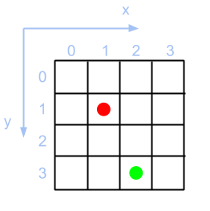
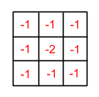

# Space Tyckiting

The game is Space Tyckiting and your goal is to cannon other teams to death. You will create an AI for the game. The AI will control a single team, which consists of 3 bots.


You can have discussion and ask questions in Gitter chat. Please join the chat room by clicking the button below.

[](https://gitter.im/futurice/space-tyckiting?utm_source=badge&utm_medium=badge&utm_campaign=pr-badge&utm_content=badge)


## Get started

Before starting, you need to have [node](http://nodejs.org/) installed.

Follow these steps to get all running:

* [Clone this repository](https://help.github.com/articles/which-remote-url-should-i-use/#cloning-with-https-recommended) from GitHub to your computer.

* In the *space-tyckiting* directory, run:

        npm install

    *This will fetch half of the internet, it might take a while.*

* Run `node start-server.js` to start the game server

* Then start two AIs to start the game

    `node start-ai.js --ai=dummy --port=4000`
    `node start-ai.js --ai=mastermind --port=5000`


* Open http://localhost:4000 and http://localhost:5000 with your browser and watch the action from the point of view of either bot.

After the game has finished, reload either one of the browser pages to start a new game with same bots.


When you get the example bots running, follow with [Creating a new AI](#creating-a-new-ai) !


## Creating a new AI

Choose your team's / AI's name. Two teams can't have the same name.
Remember this when you are locally developing.

Run ```./create-new-ai your-ai-name```, open `client/ai/your-ai-name/ai.js` and edit the code! You can run your AI with e.g. `node start-ai.js --bot=your-ai-name --port=5000`.

There's a very simple example of an AI which you should take a look at: [client/ai/dummy/ai.js](client/ai/dummy/ai.js).

There are two example bots to test your solution:

* **dummy** which just moves around randomly
* **mastermind** which scans the grid randomly and cannons enemies


## Game rules

AI is sometimes referred as team in the specs. **AI is the same as a team**.
Exploiting bugs or unintended holes in the framework is prohibited.

This is a grid-based game and the map represents the surface of a planet. The game grid is 28 x 28. Two teams will play against each other, and each team has 3 bots. Each of the three bots have 10 health points at the beginning of the game. The whole team is considered alive as long as they have 1 or more bots alive.




The game is turn-based, and on each turn, teams send their next actions to the server, which executes the actions and responds what happened. On a team's turn, the AI can order any following actions for their bots - 1 per bot. In other words, team has 3 actions it can make per turn.

* **Move** 1 or 2 steps. Moving diagonally is also considered as 1 step. In other words you can move anywhere inside a 5 x 5 grid.

* **Cannon** point *(x, y)*. An exact hit will cause *-2 HP*  and a hit to a neighbouring cell will cause *-1 HP*. In other words, the blast covers a 3 x 3 grid.

    Figure of HP losses inside blast radius:

    

* **Radar** an area centered at point *(x, y)*. Radaring reveals players as far as 3 steps away from the center. In other words, radar covers a 7 x 7 grid. You will be norified if you were detected.

* **Message** a text message. This is broadcasted to all other teams. Message is not considered an action. You can for example send a message **and** move with a bot in the same turn.


Player actions will be executed in the following order:

* Moves
* Radars
* Cannons

There will be two or more bots in the arena. Two or more bots can move to the same point but they will all take same amount of damage when the point is cannoned. Bots can see enemy bots for a distance of 2 steps from their current position.

### Game flow

After each turn has been played, teams receive `events` which describes what happened in the last round.

**All possible events**

* `round` The current number of the round. Increases with each game loop.

* `hit` Bot has been hit. This might mean that you have been hit, or you hit another bot.

    `id` will identify the target of the damage. If you have been hit,
    the data will contain an additional `hp` value which will tell how many
    health points you lost. You won't receive the `hp` data when hitting others.

* `die` Bot has died. This might mean that you died, or that you killed another bot.

* `see` Results from radaring or seeing bots. You will never be included in this event.

* `detected` You will be notified that you have been seen or radared.

* `move` Your or one of your team bots new position after move action. Cannot move out of map.

* `message` Messages from other bots.

Example of *events object*:

```json
{
    "type": "events",
    "data": [
        {
            "event": "round",
            "data": {
                "roundId": 1
            }
        },
        {
            "event": "hit",
            "data": {
                "hp": -1,
                "id": 0
                "name": "T-1",
                "team": "Solid"
            }
        },
        {
            "event": "detected",
            "data": {
                "id": 0
            }
        },
        {
            "event": "see",
            "data": {
                "positions": [
                    {
                        "id": 1,
                        "name": "Terminator",
                        "team": "Havoc"
                        "x": 0,
                        "y": 1
                    }
                ]
            }
        },
        {
            "event": "message",
            "data": {
                    "messageId": 78,
                    "source": {
                        "id": 1,
                        "name": "Terminator",
                        "team": "Havoc",
                    },
                    "message": "Hasta la vista, baby"
                }
            }
        }
    ]
}
```

**Detailed game flow**

The framework implements the details of game flow under the hood. This is just "good to know" information.

0. Each bot connects to server.
1. Each bot sends `join`
2. After required amount of bots have joined, the game starts
3. Loop until the number of living teams is less than or equal to 1

    * Each bot sends its action. Bots have *100ms* to respond or their message is considered a `skip`
    * Server sends `events` to each bot. If there are more than one bot at same side, each bot receive all the events of the bots at same side.
4. Server broadcasts `end`

You can find detailed protocol documentation [here](DETAILS.md). It shouldn't be needed for AI development though.
